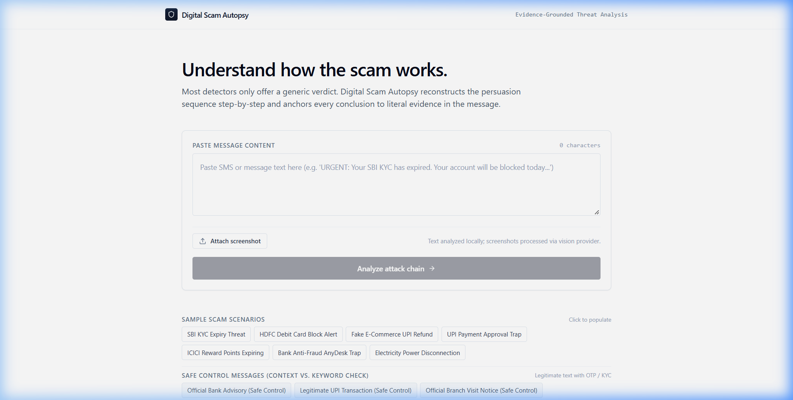
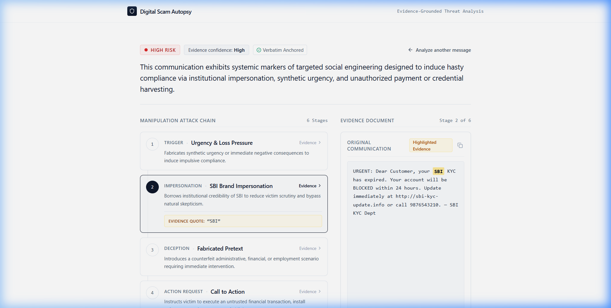
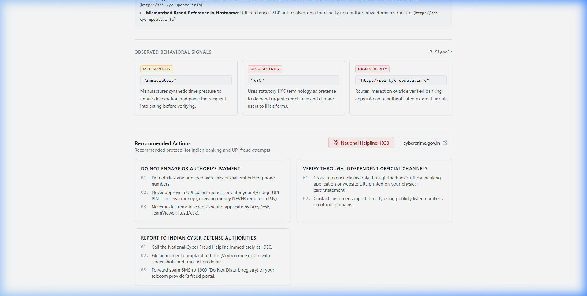
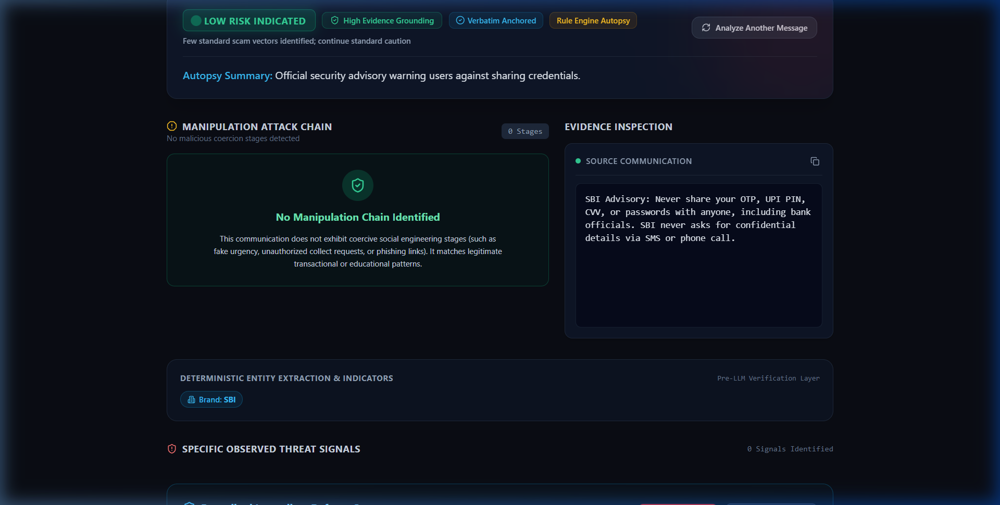

<div align="center">

# Digital Scam Autopsy

**An evidence-grounded threat analysis engine that deconstructs social engineering manipulation funnels.**

Focused on Indian UPI, KYC, and banking fraud vectors.

[](https://nextjs.org/)
[](https://www.typescriptlang.org/)
[](https://tailwindcss.com/)
[](LICENSE)

</div>

---

## The Problem & Core Thesis

> **Don’t build another black-box "Is this a scam? Yes/No" checker. Build a "Show me how this scam works" analyzer.**

Most scam checkers simply output an uncalibrated verdict or percentage probability without explaining the underlying attack mechanics. 

**Digital Scam Autopsy** is built on three strict engineering principles:
1. **Verbatim Evidence Anchoring**: Every observed indicator and attack stage must be a literal substring of the victim's message. Hallucinated evidence is programmatically rejected.
2. **Deterministic Pre-Analysis**: Observable domain entities (UPI VPAs, phone numbers, amounts, claimed brands, URL anomalies) are extracted deterministically prior to contextual analysis.
3. **Context Over Keywords**: Official security advisories (e.g., *"Never share your OTP with anyone"*) and routine payment receipts evaluate to **LOW RISK** with **0 attack stages**, preventing false alarms on educational or transactional text.

---

## Product Walkthrough

### 1. Minimal Input Utility
Users can paste raw SMS/WhatsApp text or upload message screenshots. Includes pre-configured one-click test scenarios across banking, UPI, utility, and negative control categories.

<p align="center">
  
</p>

### 2. Manipulation Attack Chain & Document Inspection
The core visualization breaks the attack down into sequential persuasion stages (`Trigger` → `Impersonation` → `Deception` → `Action Request` → `Target` → `Consequence`). Selecting any stage immediately highlights the exact evidence quote inside the source message.

<p align="center">
  
</p>

### 3. Observable Properties & Immediate Defense Protocol
Displays extracted UPI VPAs, phone numbers, isolated URL properties (punycode, unencrypted HTTP, shorteners), actionable countermeasures, and direct links to **Helpline 1930** and **cybercrime.gov.in**.

<p align="center">
  
</p>

### 4. Adversarial Negative Control (Contextual Safety)
When an official security advisory or transaction receipt contains sensitive keywords like `OTP` or `PIN`, the engine correctly recognizes the context and outputs **LOW RISK** with zero attack stages.

<p align="center">
  
</p>

---

## Architecture & Data Flow

```text
               INPUT (Pasted Text, Screenshot, or Telegram Forward)
                                     │
                       ┌─────────────┴─────────────┐
                       ▼                           ▼
               Vision OCR Provider         Text Normalization
             (Screenshots only)                  (NFKC)
                       │                           │
                       └─────────────┬─────────────┘
                                     ▼
                        DETERMINISTIC RULE ENGINE
                      • Regex Entity Discovery (UPI VPAs, Phones, Amounts, Brands)
                      • Lexical URL Property Analysis (Punycode, Raw IP, Shorteners)
                      • Indian Banking Heuristics (Urgency, KYC Bait, Credential Bait)
                                     │
                                     ▼
                           CONTEXTUAL ANALYZER
                      (Deconstructs Manipulation Funnel)
                                     │
                                     ▼
                           ZOD SCHEMA VALIDATOR
                            │                │
                        [Valid]          [Invalid]
                            │                │
                            │          Repair Retry
                            │                │
                            ├────────────────┘
                            ▼
                 LITERAL EVIDENCE GROUNDING CHECK
               • Enforces exact substring occurrence in message
               • Stores character start/end offsets
               • Computes deterministic evidence confidence
                                     │
                        ┌────────────┴────────────┐
                        ▼                         ▼
                 EDITORIAL WEB UI           TELEGRAM BOT
            • Apple/Linear aesthetic     • Direct message forward
            • Interactive step timeline  • Instant forensic reply
            • Document highlight sync    • Zero app installation
```

---

## Verified Test Matrix

| Scenario | Attack Category | Evaluation | Stages | Verified Grounded Evidence Quotes |
| :--- | :--- | :---: | :---: | :--- |
| **SBI KYC Expiry Threat** | Coercive Phishing | `HIGH RISK` | 6 | `"immediately"`, `"SBI"`, `"KYC has expired"`, `"Update immediately"`, `"http://sbi-kyc-update.info"`, `"BLOCKED within 24 hours"` |
| **Flipkart UPI Collect** | Reverse UPI Collect | `HIGH RISK` | 6 | `"within 2 hours"`, `"Flipkart"`, `"refund pending"`, `"Accept collect request"`, `"9876543210@ybl"`, `"money will be cancelled"` |
| **Bank Anti-Fraud Alert** | Remote Access Trap | `HIGH RISK` | 5 | Authority pretense (`"fraud department"`), Remote tool (`"AnyDesk"`), Credential harvesting |
| **Electricity Disconnection** | Utility Impersonation | `HIGH RISK` | 6 | Disconnect threat (`"tonight at 9:30 PM"`), Utility authority claim, Direct VPA (`"powerboard@okaxis"`) |
| **Official Bank Advisory** | **Negative Control** | `LOW RISK` | **0** | Recognizes advisory context (*"Never share your OTP"*). No attack chain manufactured. |
| **Legitimate UPI Receipt** | **Negative Control** | `LOW RISK` | **0** | Recognizes standard transaction confirmation (*"Payment of ₹500 was successful"*). |
| **Police Scam Alert** | **Adversarial Control** | `LOW RISK` | **0** | Mentions scam patterns in an educational context (*"Beware of fake electricity bill SMS"*). No false positive. |

---

## Telegram Bot Adapter

In addition to the web dashboard, the engine includes a Telegram bot adapter (`/api/telegram`) running on the exact same core pipeline. Users can forward suspicious messages directly from their messaging apps:

1. Create a bot on Telegram via **[@BotFather](https://t.me/BotFather)** to receive a bot token.
2. Set `TELEGRAM_BOT_TOKEN` in your environment variables.
3. Configure your webhook endpoint:
```bash
curl -X POST "https://api.telegram.org/bot<YOUR_BOT_TOKEN>/setWebhook?url=https://<YOUR_DOMAIN>/api/telegram"
```

---

## Getting Started

### Prerequisites
- Node.js 18.17+ or 20+
- npm / yarn / pnpm

### Installation

```bash
# Clone the repository
git clone https://github.com/Adityag476/Digital-Scam-Autopsy.git
cd Digital-Scam-Autopsy

# Install dependencies
npm install

# Configure environment variables (optional for live AI / Telegram)
cp .env.local.example .env.local
```

### Environment Variables (.env.local)

```ini
# Optional: Provider key for contextual attack chain & screenshot vision
# (Without this key, text analysis runs 100% deterministically via rule-engine fallback)
GEMINI_API_KEY=your_gemini_api_key

# Optional: Telegram bot token for the webhook endpoint
TELEGRAM_BOT_TOKEN=your_telegram_bot_token
```

### Running Locally

```bash
# Start development server
npm run dev

# Or build for production
npm run build
npm run start
```

Visit `http://localhost:3000` to inspect messages.

---

## Civic & Legal Resources

- **National Cybercrime Helpline:** Dial **1930**
- **National Cyber Crime Reporting Portal:** [cybercrime.gov.in](https://cybercrime.gov.in)
- **DoT Suspected Fraud Communication Facility (Chakshu):** [sancharsaathi.gov.in](https://sancharsaathi.gov.in)

---

## License

This project is licensed under the MIT License — see the [LICENSE](LICENSE) file for details.
